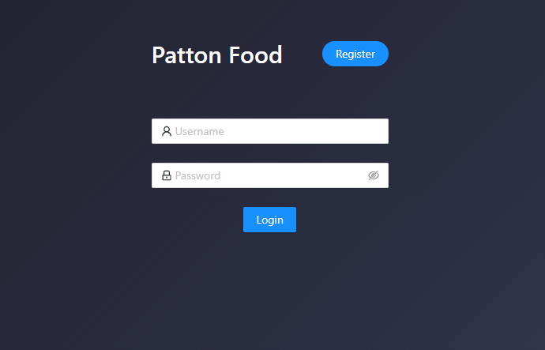
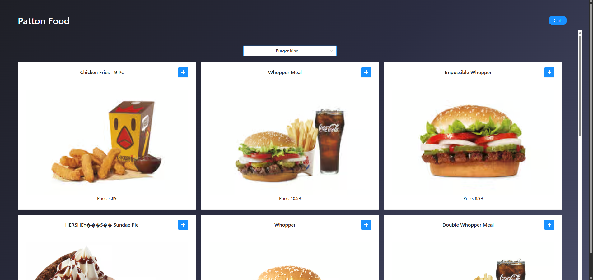
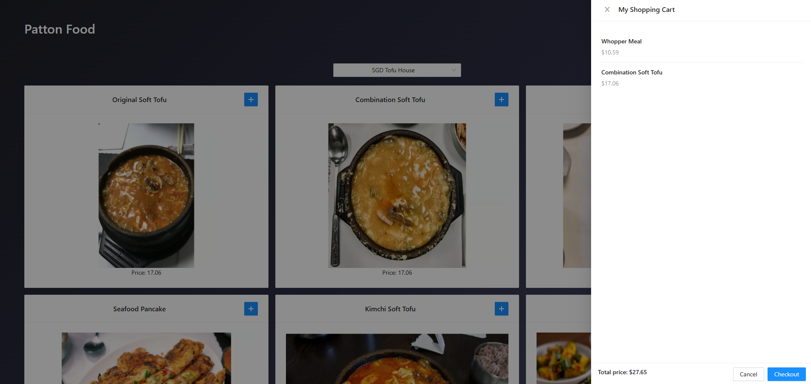

# Patton Food

**Patton Food** is a full-stack, cloud-deployed online food ordering web application.  
It allows users to register, authenticate, browse restaurants and menus, add items to a shopping cart, and complete checkout through a modern web interface.

This project was developed as an **Implementation Project for ELEN 6770 – Cloud Computing**.

---

## 🚀 Features

### 🔐 User Authentication
- User registration and login
- Session-based authentication using **Spring Security**
- Password encryption with **BCrypt**

### 🍔 Food Ordering Workflow
- Restaurant selection via dropdown menu
- Menu browsing with images and prices
- Add items to shopping cart
- View cart with real-time total price
- Checkout and order confirmation

### 🧩 Backend (Spring Boot)
- Java 17 + Spring Boot
- RESTful APIs for authentication, menu browsing, and cart operations
- Layered architecture:
  - Controller → Service → Repository → Database
- Spring Data JDBC for database access
- Caching with **Caffeine** to optimize menu queries
- Unit tests for core business logic (e.g., cart service)

### 🎨 Frontend (React)
- Built with **React** and modern UI components
- Login and registration pages
- Restaurant menu cards with images
- Shopping cart drawer UI
- Frontend bundled and served by Spring Boot as static assets

### 🗄️ Database
- **PostgreSQL**
- Stores users, restaurants, menu items, carts, and order items
- Initialized via SQL scripts for schema and seed data

### ☁️ Cloud Deployment (AWS)
- Application containerized using Spring Boot buildpacks
- Docker image stored in **Amazon ECR**
- Deployed as a managed service using **AWS App Runner**
- Cloud database hosted on **Amazon RDS (PostgreSQL)**
- Runtime configuration via environment variables

---

## 📸 Demo Screenshots

### User Login


### Restaurant & Menu Browsing


### Shopping Cart


### Successful Checkout


> Note: Screenshot paths can be updated based on your repository structure.

---

## 📂 Project Structure

The project follows a standard Spring Boot layout with the frontend build embedded as static resources:

```text
src/
├── main/
│   ├── java/com/laioffer/onlineorder/ # Backend
│   │   ├── controller/
│   │   ├── service/
│   │   ├── repository/
│   │   ├── entity/
│   │   ├── model/
│   │   └── OnlineOrderApplication.java
│   └── resources/
│       ├── public/          # React build (front end)
│       ├── application.yml
│       └── database-init.sql
└── test/
   └── java/                # Unit tests
```

## 🧪 Local Development

This section describes how to run the Patton Food application locally for development and testing.

### Prerequisites

Ensure the following tools are installed on your local machine:

- **Java 17**
  - Required for building and running the Spring Boot backend
- **Docker & Docker Compose**
  - Used to run PostgreSQL locally in a containerized environment
- **PostgreSQL Client**
  - Tools such as `psql` or DataGrip can be used to inspect the database

---

### Local Database Setup (PostgreSQL)

The application uses PostgreSQL as its primary database.  
For local development, PostgreSQL is started using Docker Compose.

1. Start the PostgreSQL container:
   ```bash
   docker compose up -d
   ```
2. This will launch a PostgreSQL instance with:
  - Database name: onlineorder
  - Username: postgres
  - Password: secret
  - Port: 5432

3. Database schema and initial seed data are automatically created at application startup using:
   ```
   src/main/resources/database-init.sql
   ```
### Backend Configuration
The backend is configured via:
```
src/main/resources/application.yml
```
Key configuration includes:
- PostgreSQL datasource URL
- Database credentials
- JDBC driver configuration
- SQL initialization settings

Spring Boot is configured to automatically execute database-init.sql on startup to ensure a consistent local development environment.

### Run the Application Locally
Ensure the PostgreSQL container is running.
Start the Spring Boot application:
```bash
./gradlew bootRun
```
The application will start on:
```bash
http://localhost:8080
```
### Local Application Behavior
When running locally:
- The React frontend is served as static assets by Spring Boot
- REST APIs are exposed under the same origin
- User authentication, menu browsing, cart operations, and checkout behave identically to the cloud deployment

## ☁️ Cloud Deployment

Patton Food is fully deployed on the AWS cloud using a container-based architecture.  
Each team member deployed an independent instance of the application to ensure availability and reproducibility during grading.

### Deployment URLs

- **Hammer’s Deployment**  
  https://bkw6fpknku.us-east-1.awsapprunner.com

- **Shufeng Chen’s Deployment**  
  https://4tpyqptei8.us-east-2.awsapprunner.com

Both URLs provide full access to the Patton Food application, including user registration, login, menu browsing, cart management, and checkout.

### Deployment Architecture

- **Containerization**
  - The application is packaged as a Docker image using Spring Boot buildpacks.
  - The image includes the backend service and bundled frontend static assets.

- **Image Registry**
  - Docker images are stored in **Amazon Elastic Container Registry (ECR)**.

- **Application Hosting**
  - The container images are deployed using **AWS App Runner**, which provides:
    - Fully managed container execution
    - Automatic scaling
    - Public HTTPS endpoints

- **Database**
  - Application data is persisted in **Amazon RDS (PostgreSQL)**.
  - Database credentials and connection details are injected via App Runner environment variables.

This deployment model removes the need for any local runtime and ensures the application is accessible directly through a browser.

---

## 📜 License

All code and resources in this repository are intended for coursework demonstration and studying purpose.

